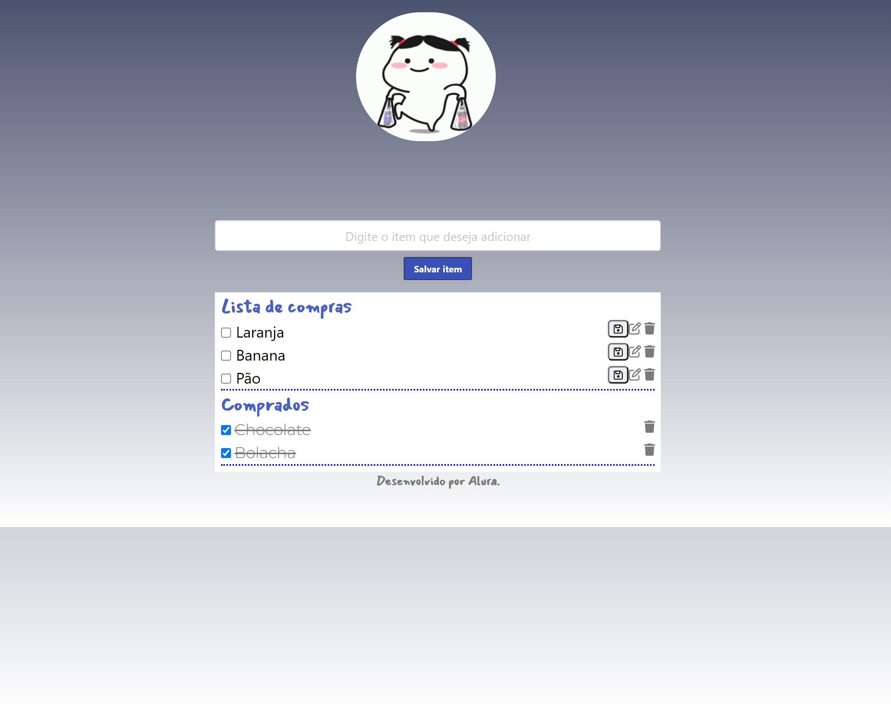

# Lista de Compras /Objetos Literais

Criei um repositoria aonde consigo anexar itens na lista de objetos para serem comprados, posuo a função de edição do mesmo e exclução e posso movelo para lista de itens já adquiridos.

 Escola Front-End Alura

## Metodos ultlizados:
<ul>
<li>Comprar, clonar e editar objetos.</li>
<li>Métodos para comparar e modificar valores.</li>
<li>Manipulação de elementos no Dom.</li>
<li>Verificaçãode valores no JavaScript.</li>
</ul>

 
 

 
 

